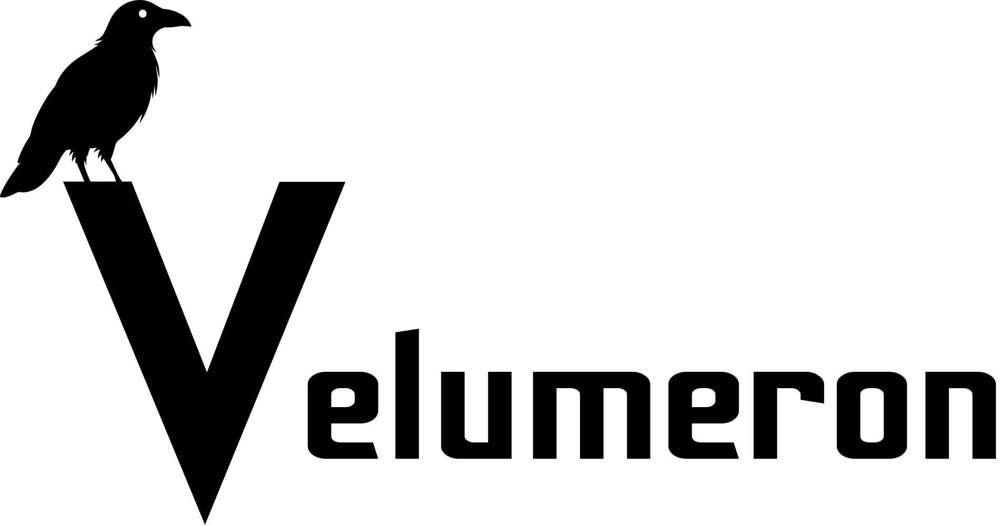

<picture>
  <source media="(prefers-color-scheme: dark)"  srcset="assets/icons/velumeron_banner-white.png">
  <source media="(prefers-color-scheme: light)" srcset="assets/icons/velumeron_banner-black.png">
  
</picture>

  

**Velumeron** is a modular Hyprland desktop for Arch Linux.

A Lua-based Hyprland config, a native **Quickshell** desktop shell (bar, menus, OSD, notifications,
settings & an application launcher), a native per-monitor **wallpaper engine** (static + live video with
GPU transitions, via a libmpv plugin), and wallpaper-driven colour theming via **wallust** — wired into
one cohesive, theme-aware environment.

---

🚧 **Work in progress — first release on its way.** 🚧

