<div align="center">

<picture>
  <source media="(prefers-color-scheme: dark)"  srcset="assets/icons/velumeron_banner-white.png">
  <source media="(prefers-color-scheme: light)" srcset="assets/icons/velumeron_banner-black.png">
  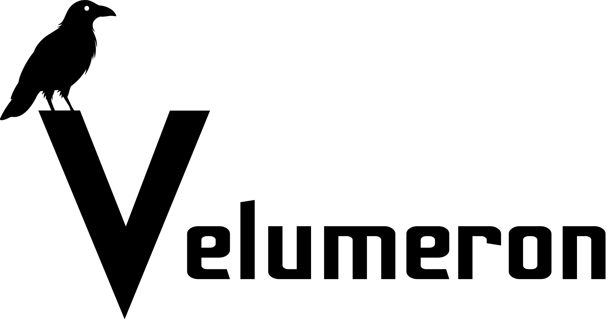
</picture>

<br>
<br>
<br>

**Velumeron** is a modular desktop for Wayland based window compositors.

</div>

A complete desktop shell: bar, notifications, OSD, launcher, lock screen, wallpaper engine,
calendar, window switcher. Every colour comes from your wallpaper, and every setting has a real
control in a GUI instead of a line in a dotfile.

Each part is one switch. They are all on out of the box. Turn one off and Velumeron stays out of
that job instead of taking it over, so it can sit next to a bar or a lock screen you already like.

The compositor layer is Hyprland today, configured in Lua. The shell itself is layer-shell and
compositor-neutral.

<br>
<br>

## Install

```sh
yay -S velumeron-git    or    paru -S velumeron-git
```

That is it. Installed from a terminal inside a running Hyprland, the package sets itself up on the
spot (config, monitors, services, shell) and the wizard opens for the few things only you can
answer. No re-login, no second command. Everything it asks is changeable later under Settings
(`Super+X`).

Installing from somewhere else, like a TTY or over SSH? Run `velumeron-setup` once, then start
Hyprland as you always do.

Velumeron is a shell for the Hyprland you already run, not a session of its own — there is no extra
entry at your login screen. The bootstrap writes `~/.config/hypr/hyprland.lua`, and Hyprland loads
it on the next start.

From a checkout instead: `sudo make install`, same behaviour.

Requirements: an Arch based distribution and Hyprland. Everything else arrives as a package
dependency. Uninstall with `velumeron-purge-goodbye` (dry run by default).

<br>
<br>

## Features

### The bar, in three layouts

<table><tr><td width="33%">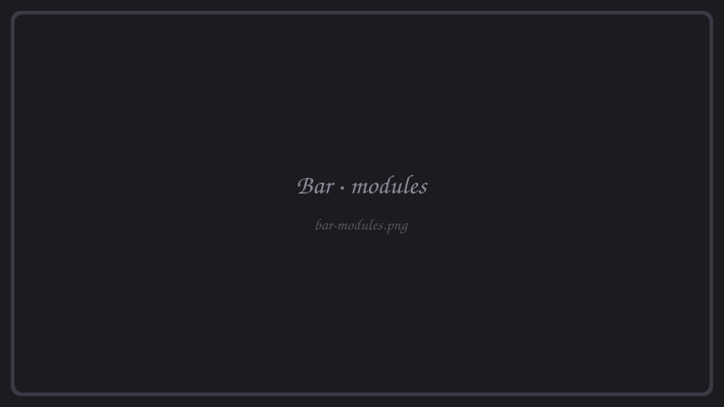</td><td width="33%">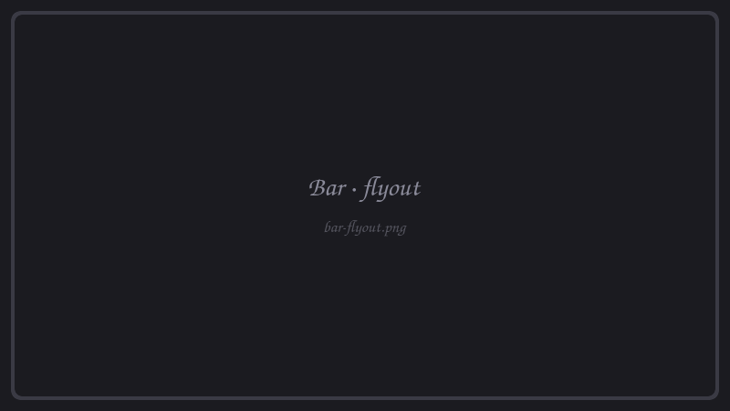</td><td width="33%">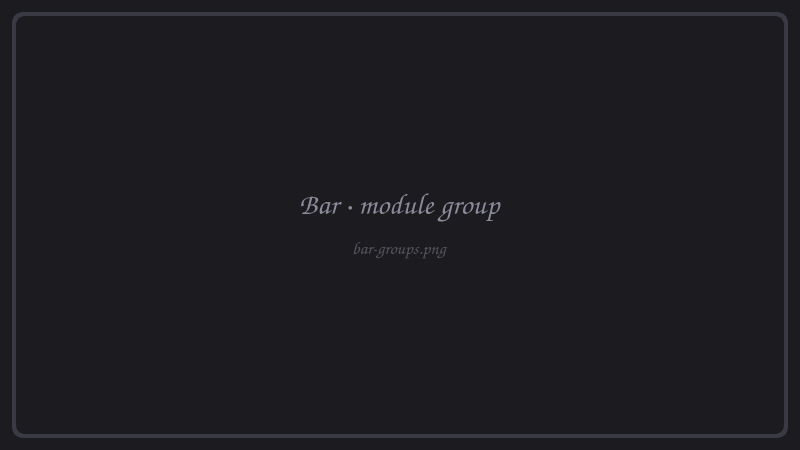</td></tr></table>

The bar is not one strip with a position setting. It is three different bars, and you can have all
of them on the same desk.

| Layout | What it is |
|---|---|
| **Dock** | Flush against one edge, reserves space, gap at both ends if you want one. |
| **Float** | One edge with a gap all around, rounded, still reserves space. |
| **Frame** | The signature look: up to four edges at once, rounded inner corners, edges without modules shrink to half thickness. |

- Each layout keeps **its own module arrangement**, and in frame mode so does every combination of
  edges: build the top bar, add the left one and both start empty for you to fill, switch the left
  one back off and the top-only arrangement returns exactly as it was.
- Every edge has three slots: start, center, end. Modules are dragged into them, not typed into a
  config file.
- Turn on per-monitor and **every bar setting forks per screen**: your desk monitor can run a frame
  while the laptop panel runs a thin dock.
- Extra monitors get a minimal bar automatically (clock at the start, submap and workspaces at the
  end) so a second screen stays quiet without being configured.
- A fullscreen window hides the bar, and peek brings it back when you touch the screen edge.
- Menus grow out of the bar itself instead of appearing next to it, and the bar's own outline
  closes behind them.
- Sizing per bar: thickness, float gap, side gap, inner radius, outline width, corner inset, module
  margin and spacing, module background (none, per group, per module) with its own radius and
  opacity, icon size, font size, opacity and blur.
- Every module has a gear: its own font, font size, icon size, colour role, plus its own options.
- Any set of modules can be collapsed into a **group**: one pill in the bar, all of them in one
  flyout, with a name and an icon you pick.

**Time and status**
- **Clock**, with your own time and date format, and a dot when a task is due.
- **Performance**: CPU, memory, GPU and power profile. Right click drops btop out of the bar.
- **Battery**, with a low warning, plus the charge of your mouse and keyboard.
- **Temperature**, in Celsius or Fahrenheit.
- **Updates**: pending repo, AUR and flatpak counts, click to update, right click to re-check.

**Connectivity**
- **Network**: Wi-Fi list, connect and forget, throughput on hover, SSID on the bar.
- **VPN**: connection state and switching.
- **Bluetooth**: devices, pairing, renaming, your own groups.
- **Tray**: StatusNotifierItems with the shell's own context menus, inline or collapsed into one
  glyph.
- **Phone**: a KDE Connect device at a glance. Battery, signal, send files, ring it.

**Media and sound**
- **Volume**: output and input, per-application streams, per-device routing.
- **Media**: title, transport, album art as a spinning record, spectrum backdrop.

**Workspace**
- **Workspaces**, per monitor, with the number on the active one.
- **Submap**: the active Hyprland submap.
- **Tasks**: the open windows on this monitor.
- **Layout**: the current tiling layout, switchable from the bar.

**System and personal**
- **Notifications**: unread count, hover peeks at the last few, click opens the centre.
- **User**: avatar and name, session actions on hover.
- **Wallpaper**: opens the wallpaper quick menu.
- **Velumeron icon**: opens the settings menu.
- **Group**: your own named collection of any of the above, in one pill.


### Shell surfaces

<table><tr><td width="33%">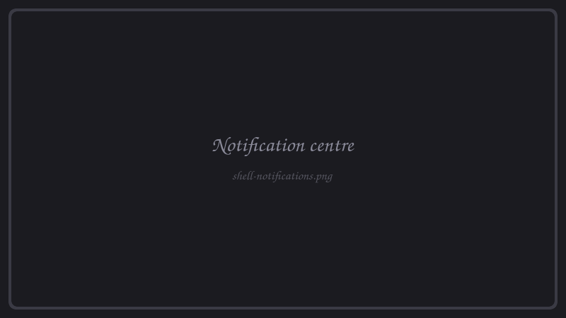</td><td width="33%">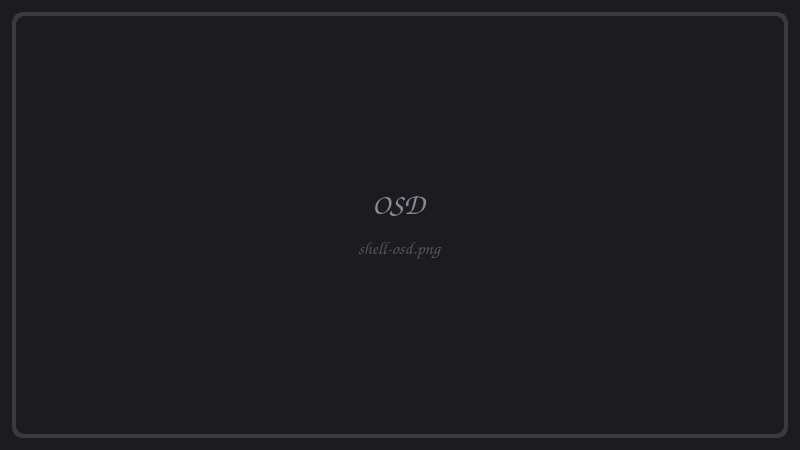</td><td width="33%">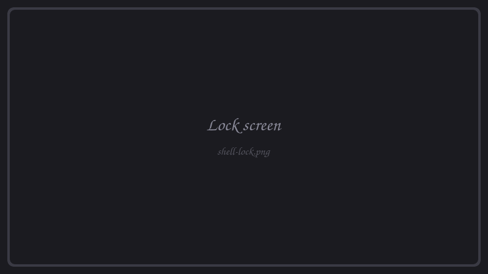</td></tr></table>

- **Notifications**: the shell owns the freedesktop bus itself. Toasts in any corner, docked to the
  bar or floating, same-app grouping, do not disturb, main monitor only if you like.
- **Notification centre**: history that grows out of the bell module, stacks expand on click.
- **OSD** for volume, brightness and workspace changes. Nine placements, float or dock, its own
  duration and size, bar or value or both.
- **Glides**: a small pill that slides out of a module on hover. Volume, performance, network,
  bluetooth, tray, session actions, workspace, notification peek, updates, file transfers.
- **Taskbar**: a strip of open windows, with pinned apps that show whether they run or not. Nine
  placements, dock or float, always visible or on hover, scoped to the monitor, the workspace or
  everything, and it can reserve space like a bar.
- **Lock screen**: native, authenticating through PAM directly. No hyprlock underneath.
  Presets, a card you place and size in percent, wallpaper crop, avatar, blur on the background or
  on the card, your clock format and weight, and widgets you drop into six zones (media, weather
  with a forecast, battery, user, session). Build your own in a live editor.
- **Screensaver**: your wallpapers, slowly, after a while away. It runs as a normal overlay while
  the session is unlocked and inside the lock screen once it is locked, so it looks the same either
  side of the password prompt.
- **Sounds**: a native pack for login, logout, lock, unlock, screenshot, notification and critical
  notification. Per event on or off, one volume, or fall back to the installed system theme.
- **Splash**: a curtain over the shell's own start, so the bar is finished before you see it.
- **Setup wizard** on first run (workspaces, wallpaper, apps, avatar) and a **what's new** report
  after an update, both in the same window.


### Launcher

<table><tr><td width="33%">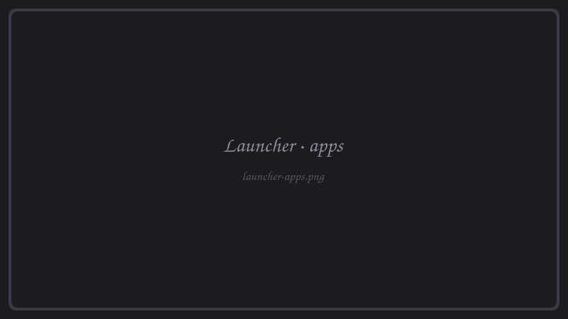</td><td width="33%">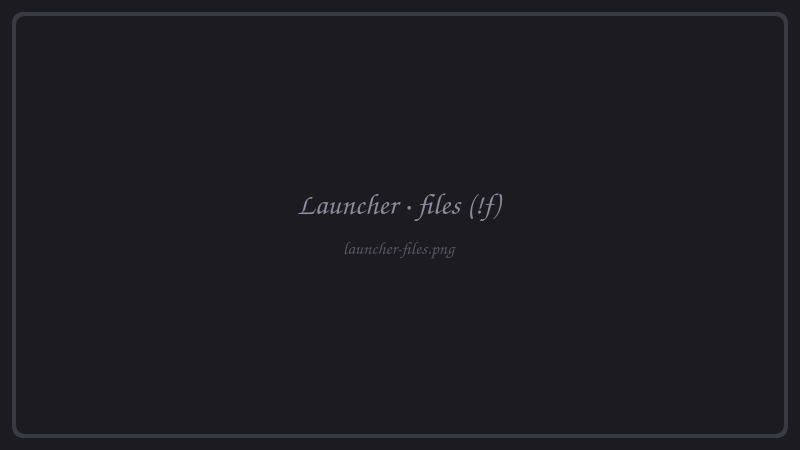</td><td width="33%">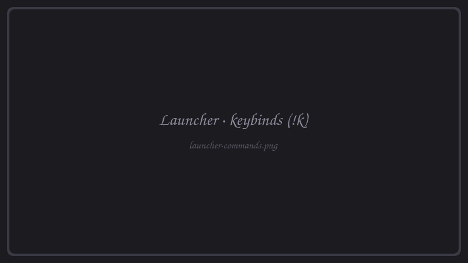</td></tr></table>

- Applications by default, fuzzy or plain substring, your choice.
- One **function key per mode**, printed on its button: apps, files, commands, the shell's own
  actions, your keybinds, the cheatsheet, the fullscreen board. The old prefixes (`>`, `!f`, `!v`,
  `!k`, `?`) still work for anyone who knows them.
- Files are browsed with real thumbnails, including video first frames.
- A **sidebar** carries those buttons on a cut of your wallpaper, so the modes are something you
  see and click instead of something you have to remember. It can show the piece of wallpaper it
  covers, a strip cut from the whole picture, your own image, or nothing at all — and against a
  vertical bar it becomes a band above the results instead of a rail beside them.
- List, grid or a fullscreen app grid. Docked to a bar edge, in any of nine slots, or standalone in
  the middle of the screen.
- The **fullscreen board** is one button away at any time, covers the screen bar and all, and can
  be what the launcher opens as. Its **overview** style puts a row of workspace cards above the
  grid — each one a miniature of the monitor with your real windows in their real places.
- Width and rows are remembered per view, so list and grid do not fight over one size.
- One window doing four jobs, instead of four separate tools.


### Window management

<table><tr><td width="33%">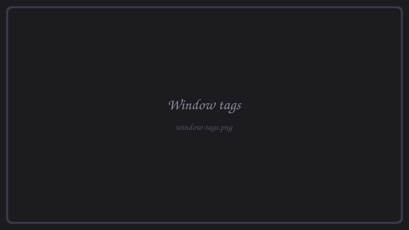</td><td width="33%">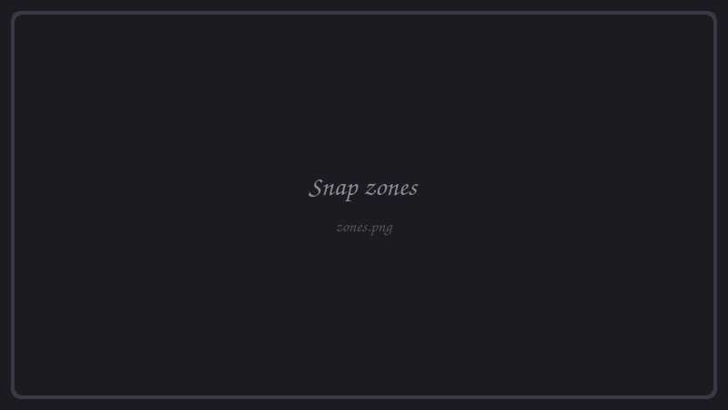</td><td width="33%">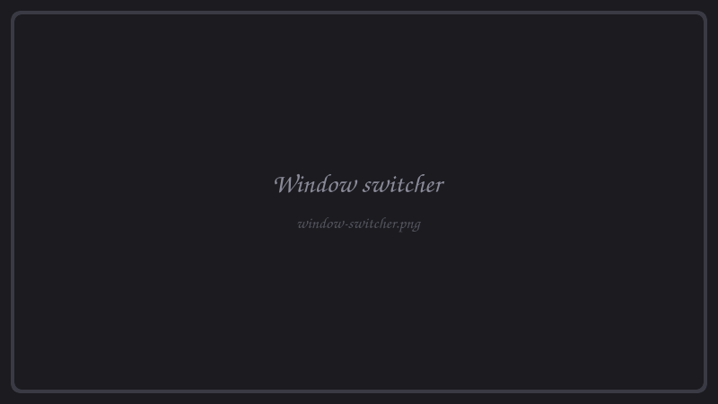</td></tr></table>

- **Window tags**: a label floating on each window, so a screen full of terminals stops being a
  guessing game. Fades with cursor distance, title or app name, its own position, size and per
  monitor switch.
- **Snap zones**: your own fields for floating windows. Drag with Super, drop into a zone, the
  window takes that shape. Seven presets, your own gap, and a different layout per monitor.
- **Window switcher**: Alt-Tab across workspaces with live previews.
- **Layout switcher**: a second switcher on Super+Alt+Tab for the tiling layout of the active
  workspace.
- **Layouts**: named layouts on top of Hyprland (columns, rows, grid, main and stack, plus monocle,
  floating and endless), each with its own gap, ratio and side. Set one globally, per monitor or
  per workspace.
- **Window rules**: size, position, workspace, floating and opacity per application, written in the
  GUI instead of in `windowrulev2` lines.
- **Monitors**: resolution, refresh rate, scale, rotation and arrangement by dragging, with a
  fifteen second keep or revert countdown in case a mode change blacks out a screen.
- **Workspaces**: names, per monitor assignment, persistence and defaults, plus the magic workspace
  for stashing a window out of the way.
- The whole Hyprland config is Lua, and the GUI writes it for you.


### Overlays and keys

<table><tr><td width="33%">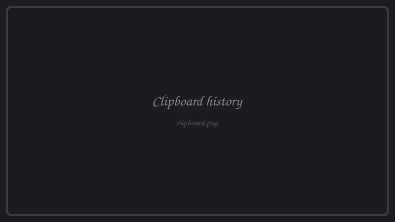</td><td width="33%"></td><td width="33%">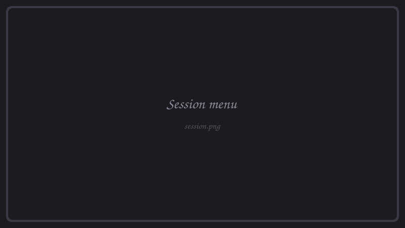</td></tr></table>

- **Clipboard history**: searchable, with image entries, backed by clipvault.
- **Keybind cheatsheet**: every binding, grouped and searchable, generated from the config you
  actually run rather than from a list someone maintains by hand.
- **Session menu**: lock, suspend, log out, reboot, shut down. Suspend waits until the lock screen
  has actually drawn before the machine goes down.
- **Hot corners**: eight zones (four corners and four edge centres), each with its own action and
  dwell time, optionally different per monitor, and any of them can stay empty.
- **Screenshot**: a picker on Super+Shift+S for a selection, a window or a whole screen, with copy,
  save, a delay and your own folder. The receipt notification opens the file.
- **btop dropdown**: a terminal running btop drops out of the bar, themed from the live palette,
  using its own profile so your personal btop config is untouched.
- **Quick access**: Super+F1 to F12 for the twelve apps you actually use.
- Every overlay is also an IPC call, so anything here can be a keybind, a hot corner, a dashboard
  button or a script.


### Settings, not dotfiles

<table><tr><td width="33%">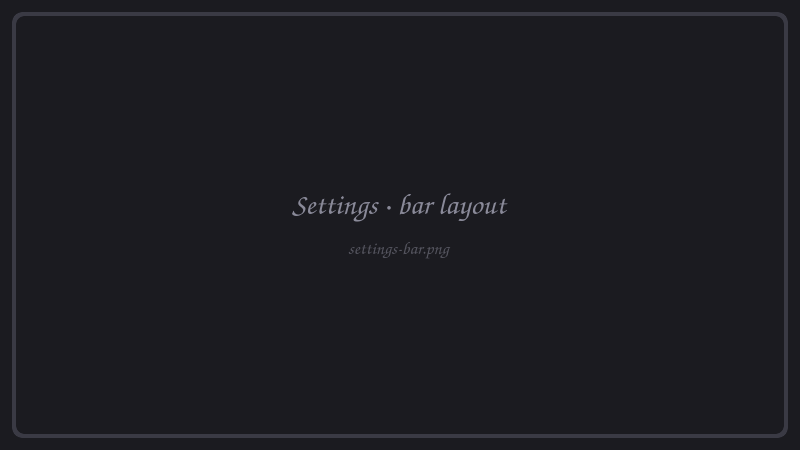</td><td width="33%">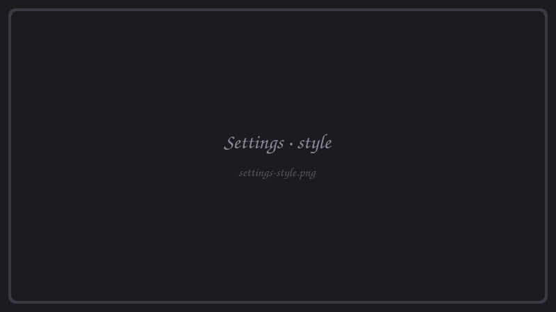</td><td width="33%">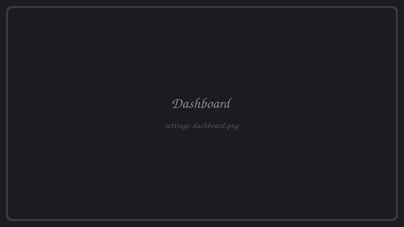</td></tr></table>

- One menu for the whole desktop, in six groups: Monitors, Workspaces, Peripherals, Boot and
  login, OpenRGB; Style, Wallpaper, Lockscreen, Screensaver, Sounds; Bar, Taskbar, Launcher, OSD,
  Notifications, Calendar, Hot corners; Layouts, Zones, Window rules, Window tags, Keybindings;
  Default apps, Autostart, Quick access, Integrations; Shell and Info, plus Network and Bluetooth
  managers.
- **Default apps** are the system's, not ours: which app opens a link, a folder, a picture or a
  song is written through `xdg-mime`, so every `xdg-open` on the machine follows it — the same
  choice a GNOME or KDE panel would make.
- It writes the same files you could edit by hand, and the shell reacts while you are still
  looking at it.
- Navigate by an icon rail or page by page, glued to the bar or floating as a window, sized in
  percent per monitor.
- The home page is a **dashboard you arrange yourself** from tiles: greeting, volume and brightness
  sliders, power profile, quick toggles for do not disturb, night light and caffeine, buttons that
  fire any action, system glances, now playing, network, bluetooth and spacers. Drag them on a
  grid, resize them in cells, put the same tile down twice with different content.
- **One switch per feature.** Bar, launcher, notifications, OSD, taskbar, lock screen, wallpaper,
  clipboard, session, window switcher, window tags, zones, hot corners, calendar, keybind help,
  sounds and the onboarding can each be switched off, and then Velumeron simply is not there for
  that job.


### Wallpaper and colour

<table><tr><td width="33%"></td><td width="33%">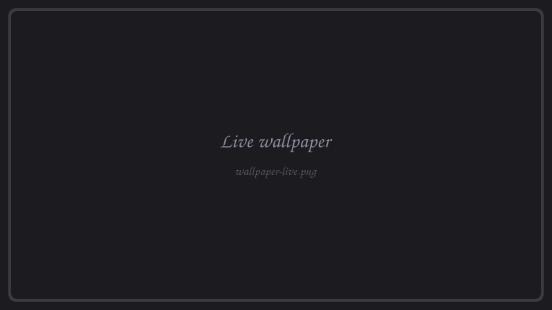</td><td width="33%">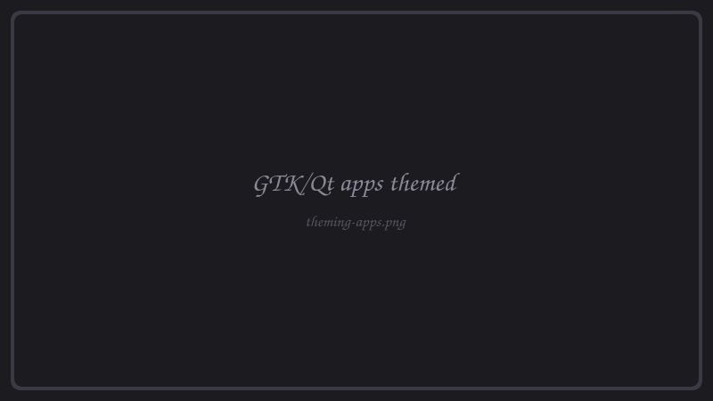</td></tr></table>

- Per monitor, static images or **live video**, driven by a libmpv to QtQuick plugin that builds
  itself on first launch.
- GPU transitions between them: fade, circle, diamond, wipe, blinds, slide or random, each with its
  own origin, angle and direction.
- Pick from a popout that grows out of the bar, or a fullscreen gallery that turns the folder into
  a coverflow with the live wallpapers actually playing.
- **Sets** apply one wallpaper per monitor in a single click. **Stacks** let you switch a whole
  subfolder off when you are not in the mood for it.
- Auto change on a timer, in alphabetical or random order, across all folders or grouped per
  folder, silently or with a showcase.
- Whatever is behind you decides the colours. **wallust** derives a palette and it lands everywhere
  at once, live and without a restart.
- Or do not derive it at all: pick a fixed scheme (Catppuccin, Dracula, Gruvbox, Nord, Rose Pine,
  Solarized), tune the extraction (balanced, vibrant, soft, rich, precise), or build your own
  palette by hand in the editor.
- The palette reaches the shell, GTK, Qt, your icon theme and the mouse cursor, which is generated
  in your accent colour.
- **Integrations** hand it to other tools, reversibly, with your own config backed up byte for
  byte: kitty, Alacritty, foot, WezTerm, Ghostty, fastfetch, starship, cava, btop, spotify_player,
  VSCodium, Neovim and Firefox through pywalfox.
- A global dark and light switch, a colorful mode that blends the accent into surfaces, a surface
  contrast step, your own UI font, and one motion system you can retune.


### Calendar and tasks

<table><tr><td width="33%">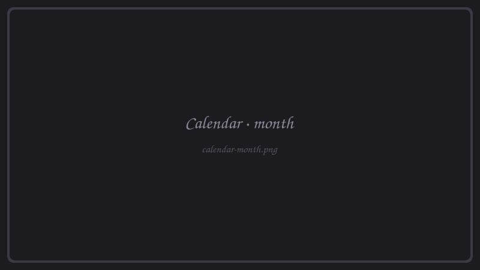</td><td width="33%">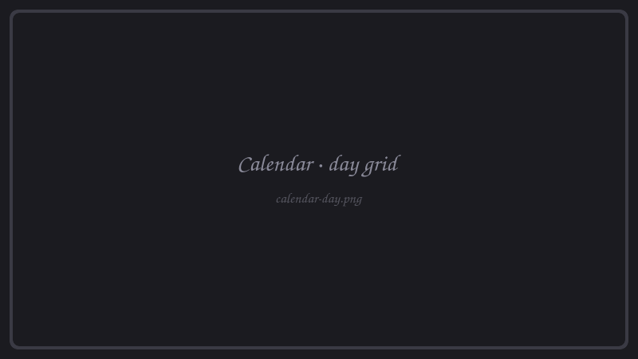</td><td width="33%">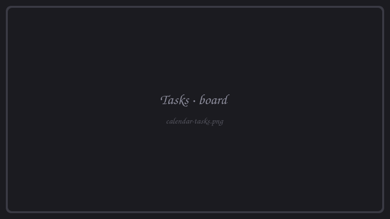</td></tr></table>

- A real client, not a month printout. Events are created and edited in place, the day grid puts
  them on a timeline, and tasks live on a board next to them.
- **No account needed.** Local calendars and task lists live in one file on your machine and never
  leave it.
- **CalDAV** for anything that speaks it, Nextcloud included. Credentials stay in a file only your
  user can read.
- **Vikunja** comes in over its REST API, because CalDAV has no notion of a project tree or of
  subtasks. Both feed one model, so a Vikunja project and a CalDAV list sit on the same board.
- Recurring events are expanded locally, quick add understands `14:00 Standup`, and every list can
  be hidden, recoloured or renamed.
- Tasks, Timer and Calendar management on the desktop are [Disponera - work in progress](https://github.com/vredix-openvuture/disponera), a
  separate application from the same workshop. It reads the very same file, so the shell and the
  app never disagree about what is done.


### Boot, login and hardware

<table><tr><td width="33%">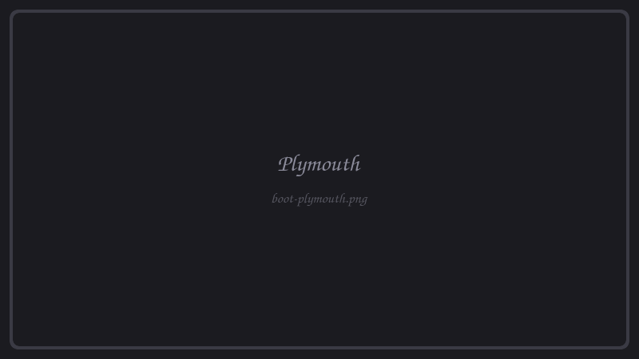</td><td width="33%"></td><td width="33%">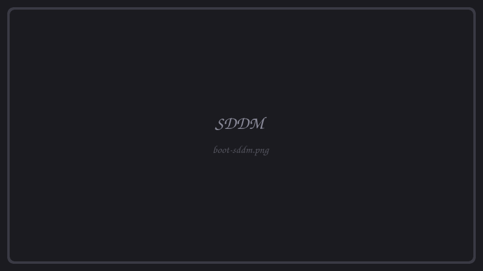</td></tr></table>

- **Plymouth, GRUB and SDDM** are managed from the same menu: every theme installed on the machine
  is listed with a preview, and applying one runs in a visible terminal that tells you what it is
  about to write. Velumeron's own theme is one entry in those lists, offered, never forced.
- Switch off the parts your machine does not have. A systemd-boot user never sees a GRUB card.
- A **Velumeron session** entry for your display manager, so a fresh install is one pick at the
  login screen.
- **OpenRGB**: off until you want it, then your startup profile is applied at login, with a
  workaround for addressable headers that enumerate at zero LEDs.
- **Service control** for everything the desktop owns: `velumeron start`, `end`, `restart`,
  `status`, plus a kill switch so a broken shell can never cost you the session.


<br>
---

## Roadmap in no specific order

- **More UI Styles.** Every style should bring a whole different user experience, with fixed anchor points like the popouts and menus. 
  Some of them are already in creation and get released one after another when finished. 
- **Calendar Improvements.** Allow integration of icloud and gmail calendar. Make UI more readable. Better management for tasks and appointments.
- **Other Wayland compositors.** The shell is layer-shell and compositor-neutral already. What is
  Hyprland-specific is the config layer and the window and workspace calls. Those move behind one
  abstraction, then sway (i3 IPC) and niri (niri IPC) follow as backends.
- **The Desktop Dashboard.** Widgets above the wallpaper and below the windows, clock,
  disk, media and much more directly on the screen instead of only inside the settings menu.
- **Clock and timer** next to the calendar, and a deeper DISPONERA (time, todo, calendar management application) integration.
- **The lock screen.** Overall improvement of the lockscreen and its possiblities.
- **Accessibility.** A global scale, a reduced-motion switch, keyboard navigation through the
  menus and a high-contrast palette mode.
- **A documentation website**, replacing the wiki in this repository.

## Far far away 

- **Builing a standalone window manager.** Velumeron should become a whole compositor.
  
## Lightyears away

- **Builiding a full arch based distro.** But who has the time for such stuff?

<br>

## Links

[Documentation](https://github.com/vredix-openvuture/velumeron-wiki) ·
[Changelog](CHANGELOG.md) ·
[Disponera](https://github.com/vredix-openvuture/disponera)

MIT licensed.

---

<br>
<br>

<a href="https://ko-fi.com/openvuture"></a>

<a href="https://openvuture.com"></a> <a href="https://openvuture.shop"></a>
